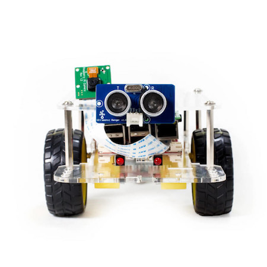

<h1>self-driving-car</h1>

  

[comment]: <> (Needs a companion CSS file to format Two cols)

<h4>Hardware</h4>
<ul>
    <li><a href="https://www.apple.com/macos/sierra/">macOS Sierra</a></li>
    <li><a href="https://www.dexterindustries.com/GoPiGo/">Dexters Industries GoPiGo</a></li>
      <ul>
          <li>Raspberry Pi 3</li>
          <li>Picamera</li>
          <li>Ultrasonic sensor</li>
      </ul>
      </li>
</ul>

<h4>Software Dependencies</h4>
<ul>
  <li>macOS:
  <ul>
    <li><a href="https://www.continuum.io/anaconda-overview">Anaconda 4.3</a> : Python 3.5 env</li>
    <li>Numpy 1.12</li>
    <li>TensorFlow 1.0 + Keras 2.0</li>
    <li><a href="http://opencv.org/">OpenCV</a> 3.1</li>
    <li><a href="https://www.pygame.org/docs/)">Pygame</a> 1.9</li>
    <li><a href="https://pypi.python.org/pypi/pyserial">PySerial</a> 3.3</li>
  </ul>
  <li>Raspberry Pi:
    <ul>
    <li><a href="http://picamera.readthedocs.io/en/release-1.13/">Picamera</a></li>
  </ul>
 </ul>

